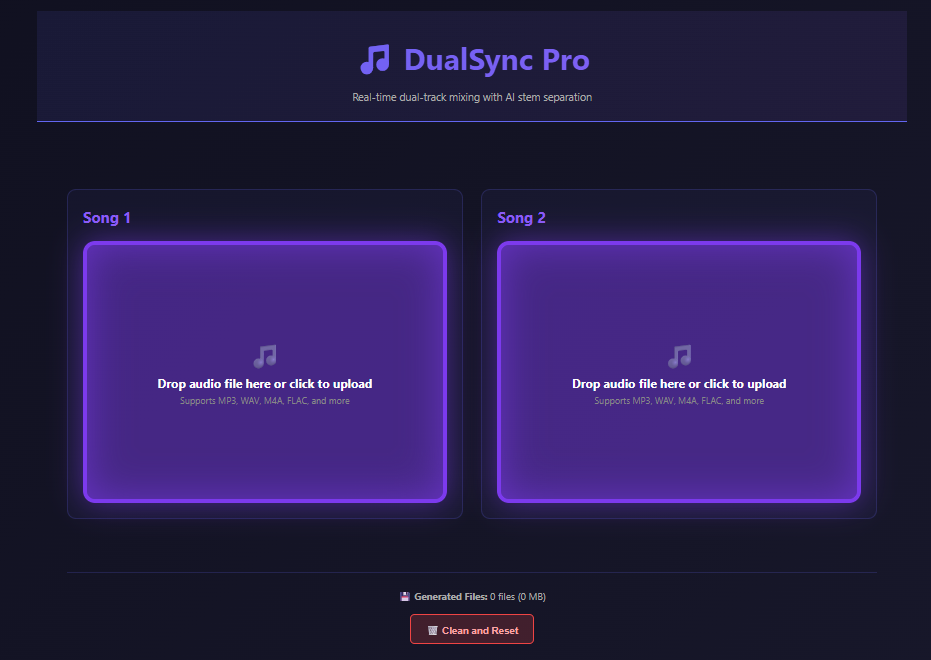
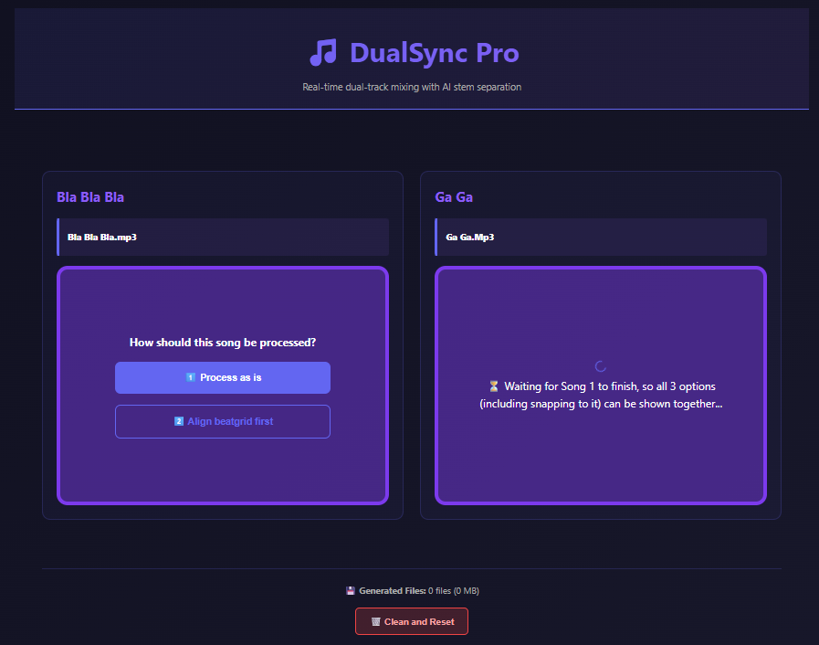
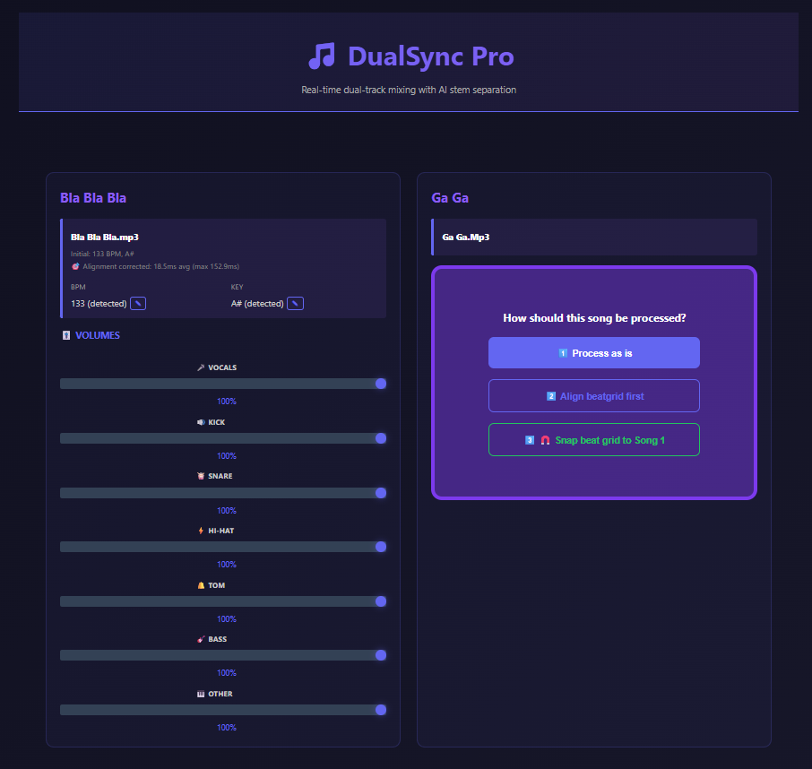
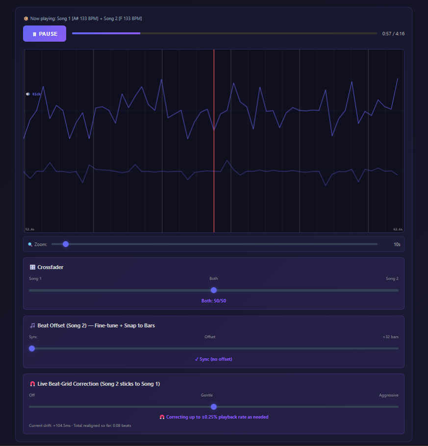
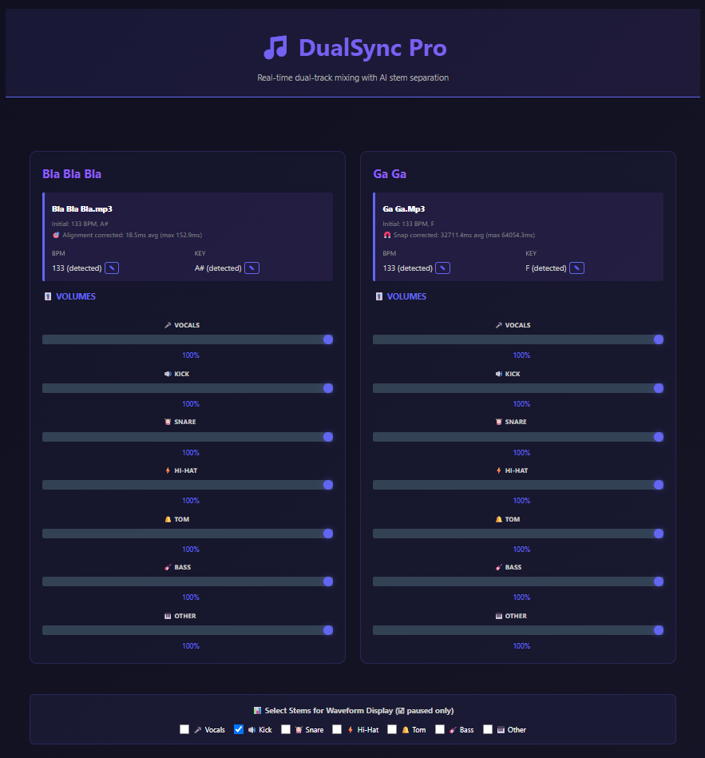
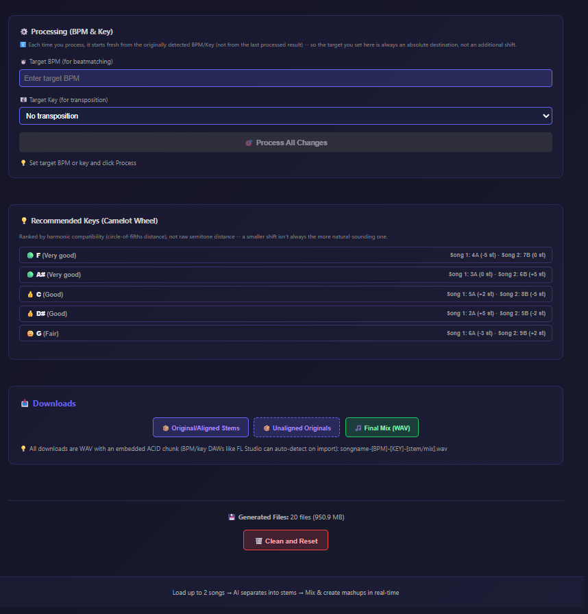

# DualSync Pro

**AI-Powered Dual-Song Real-Time Audio Mixer with Beatmatching & Key Transposition**


DualSync Pro is a modern web application for creating audio mashups. Load two songs side-by-side, automatically detect their BPM and key, beatmatch and transpose them to a common key, and mix the results in real-time with independent stem controls. All audio processing is powered by AI (Demucs for stem separation, Essentia for BPM/key detection) and professional audio tools (FFmpeg/RubberBand for beatmatching and pitch-shifting).


*Figure 1 — The intro screen you see when you first open DualSync Pro, before either song is loaded.*

---

## ✨ Features

### Real-Time Mixing
- **Dual-song mixer** — load two MP3s into independent slots with synchronized playback
- **HTML5 audio synchronization** — first song's timeline controls both songs for seamless mixing
- **Independent stem volumes** — control 7 stems separately for each song (0-100% sliders):
  - Vocals, Bass, Other (standard stems)
  - Kick, Snare, Hi-Hat, Tom (auto-split drum components via frequency-based filtering)
- **Crossfader** — blend between Song 1 and Song 2 in real-time
- **Beat Offset Control with Magnetic Snap** — manually align Song 2's beat grid, up to 32 bars:
  - Slider ranges 0-32 bars with 0.05 bar fine-tune precision
  - Snaps to the nearest whole bar automatically when you get close
  - Brief visual feedback shows snap status and current fine-tune value (bars + equivalent beats)
  - Real-time audio delay via Web Audio API during playback — the same offset is baked into the final rendered mix
  - Visual offset indicator on waveform display, with a zoom range large enough to see the full 32-bar offset
- **Live Beat-Grid Drift Correction** — a strength slider (0-100%) continuously nudges Song 2's playback rate to cancel out timing drift during playback, with a live readout of the instantaneous correction (ms) and cumulative beats realigned so far
- **Multi-Stem Waveform Visualization** — advanced beat alignment tool:
  - Select any combination of 7 stems to display (vocals, kick, snare, hi-hat, tom, bass, other)
  - Color-coded waveforms for each stem (purple, indigo, pink, orange, green, blue, gray)
  - Display both Song 1 and Song 2 simultaneously for each stem
  - Stem selection checkboxes (paused-only to prevent accidental changes)
  - Centered controls between song mixers for easy access
  - Dynamic zoom slider for variable detail levels, wide enough to view large beat offsets
  - Song 2 waveform shifts visually with beat offset for perfect alignment preview
  - Red playhead indicator showing current position
  - Visible during both playback and pause for precise alignment
  - Real-time updates as you adjust beat offset and zoom level
- **Auto-loop playback** — automatically restart at track end during playback
- **Real-time processing logs** — unified log window shows all operations with auto-scroll to latest entry
- **Clean and Reset** — a single button clears all generated audio files on the server AND resets the entire mixer UI back to its start-over state

### Audio Analysis & Processing
- **AI Stem Separation** — isolate vocals, drums, bass, and other instruments using Demucs
- **Automatic Drum Component Splitting** — further separate drum stem into kick, snare, hi-hat, and tom using frequency-based FFmpeg filtering:
  - Kick: 20-250 Hz (low bass)
  - Tom: 200-2000 Hz (mid-range drums)
  - Snare: 1000-8000 Hz (high crack)
  - Hi-Hat: 5000+ Hz (cymbals)
- **BPM & Key Detection** — Essentia (`RhythmExtractor2013` for tempo/beat positions, `KeyExtractor` for key/scale) analyzes each uploaded song
- **Two Alignment Modes on Upload** — for each song you choose:
  - **Process as-is** — keep the song's natural timing
  - **Align beatgrid** — correct internal timing drift by warping the song's own beats onto a perfectly even grid (via RubberBand `--timemap`)
  - **Snap beat grid to Song 1** (Song 2 only, once Song 1 is ready) — warp Song 2's actual beat times directly onto Song 1's actual beat times, so both tracks share one true beatgrid without relying on live drift correction
  - Both alignment modes report how much correction was applied (average/max milliseconds moved per beat)
- **Beatmatching with Verification** — align Song 2 to Song 1 (or both to target BPM) with automatic multi-pass correction
  - Pass 1: FFmpeg tempo-stretching (stable baseline)
  - Pass 2+: Optional RubberBand for higher quality (if available)
  - Automatic re-analysis after each pass to verify convergence (±10 BPM tolerance)
- **Key Transposition** — pitch-shift tracks to match target key
- **Camelot Wheel Key Recommendations** — ranks up to 5 candidate keys by harmonic distance (circle-of-fifths) to both songs simultaneously, showing a quality label (🟢 Very good / 👍 Good / 🙂 Fair / 🆗 Ok) and the exact Camelot code + semitone shift needed for each song; flags the pair as "✅ No change needed" when they're already harmonically compatible

### Downloads & Exports
- **Lossless WAV with DAW-readable tempo/key metadata** — every exported file is a WAV carrying a Sonic Foundry **ACID chunk** (the convention FL Studio, Logic, Cubase, Reaper, Reason, Sound Forge, and Samplitude all read to auto-detect a sample's tempo and root key on import), plus standard ID3 tags (title, artist, BPM, key)
- **Measured BPM in filenames** — actual output BPM shown in filenames (not target)
- **Smart naming convention:**
  - Original stems: `songname-[detected-bpm]-[key]-[stem].wav`
  - Processed stems: `songname-[measured-bpm]-[key]-[stem].wav`
  - Manual BPM override: `songname-[target]-manual-[measured]-[key]-[stem].wav`
- **22 downloadable files** (all as tagged WAV with verified output BPM):
  - Original Song 1 stems (7 stems: vocals, kick, snare, hi-hat, tom, bass, other)
  - Original Song 2 stems (7 stems: vocals, kick, snare, hi-hat, tom, bass, other)
  - Beatmatched + transposed stems (7 stems with verified output BPM)
  - Final mix (all stems combined with volume settings + crossfader, fully lossless — no intermediate MP3/lossy step)
- **ZIP archives** — organized downloads with accurate naming

### User Experience
- **Explicit Process buttons** — Process BPM and Process Key buttons only enabled when values change from last processed state
- **Real-time progress indication** — animated progress bars during beatmatching and key transposition
- **Processing state display** — visual feedback showing which stems version is currently being used
- **Drag-and-drop upload** — intuitive file loading with visual feedback
- **Responsive design** — works on desktop browsers
- **Locked controls during processing** — all mixing controls disabled while beatmatching or transposition is in progress

---

## How It Works

### 1. Upload & Analyze
When you upload an MP3 file:
1. **Upload & Convert** — the file is converted to WAV and Essentia detects its BPM, beat grid, and key
2. **Choose a mode** — Process as-is, Align beatgrid, or (for Song 2, once Song 1 is ready) Snap beat grid to Song 1
3. **Stem Separation** — Demucs AI model isolates 4 tracks: Vocals, Drums, Bass, Other
4. **Automatic Drum Splitting** — Drums stem is further split into Kick, Snare, Hi-Hat, and Tom using frequency-based filtering (7 total stems)
5. **Real-Time Logging** — unified log window shows all processing steps (uploading, analyzing, separating, splitting)
6. Results are displayed and ready for mixing

Both songs are processed in parallel (independent uploads).


*Figure 2 — Song 1 during initial upload/processing, with its alignment-mode choice.*


*Figure 3 — Song 2 during initial upload/processing, including the "Snap beat grid to Song 1" option once Song 1 is ready.*

### 2. Prepare for Mixing
Before mixing, you can:
- **Override detected BPM** — manually enter a target BPM if auto-detection is wrong
- **Override detected Key** — manually select a different key from dropdown
- **Pick a recommended key** — the Camelot Wheel panel ranks up to 5 harmonically compatible keys for both songs together, or tells you no change is needed

### 3. Process & Beatmatch
When you click **"Process All Changes"** button (BPM + Key):
1. **Full Song Processing** — process the complete song (all stems together) for tempo and pitch
2. **Beatmatching (if BPM changed):**
   - Pass 1 — FFmpeg applies initial tempo-stretching
   - Verification — Librosa re-analyzes output BPM
   - Convergence Check — if output is within ±10 BPM of target, done; otherwise continue
   - Pass 2+ — Optional RubberBand processing for refinement (if available)
3. **Transposition (if Key changed):**
   - Pitch-shift processed song to match target key using FFmpeg asetrate
4. **Re-Separation** — Demucs re-separates the processed song into 7 stems (auto-split drums included)
5. **Stem Copying** — All processed stems copied to server with auto-scroll logs showing progress
6. **Real-Time Logging** — unified log window shows all steps: loading, beatmatching, transposing, separating, copying
7. Progress bar animates during processing, actual processing state updates when complete

The **"Process All Changes" button is enabled** only when BPM or Key has changed from last processed value.

### 4. Mix in Real-Time
(Previously step 5) After processing:
- **Advanced Beat Alignment:**
  - **Magnetic Snap Beat Offset** — drag slider (0-32 bars, 0.05 bar fine-tune increments):
    - Slider automatically snaps to the nearest whole bar
    - Brief visual feedback shows "Snapped" + fine-tune value (bars and equivalent beats) while near a bar boundary
    - Real-time audio delay applied during playback (Web Audio API) — identical offset is used in the final render
  - **Live Beat-Grid Drift Correction** — a strength slider continuously nudges Song 2's playback rate toward Song 1's grid, with a live instantaneous-drift (ms) and cumulative-realignment (beats) readout
  - Watch Song 2 waveform shift visually as you adjust offset (shows actual alignment)
  - Select any of 7 stems to display in waveform (vocals, kick, snare, hi-hat, tom, bass, other)
  - Zoom waveform dynamically for the detail level you need, wide enough to see the full 32-bar offset range
  - Compare both Song 1 and Song 2 waveforms side-by-side
  - Color-coded stems for easy identification
  - Pause to inspect waveforms without playhead movement


*Figure 5 — The multi-stem waveform display during live playback, showing both songs' beat alignment.*

- **Volume Mixing:**
  - Adjust 7 stem volumes independently for Song 1 and Song 2
  - Use crossfader to blend between songs (0% Song 1 → 50% Both → 100% Song 2)


*Figure 4 — The real-time mixing workspace, with per-stem volume sliders and crossfader for both songs.*

- **Playback Control:**
  - Play/Pause and scrub through timeline (resumes from paused position)
  - Auto-loop at track end
- **Listen:** Hear the beatmatched, transposed, beat-aligned mix in real-time with visual confirmation

### 5. Download
Download your results:
- **Original Stems** — 7 stems at auto-detected BPM/Key (before beatmatching)
- **Processed Stems** — 7 stems beatmatched + transposed with verified output BPM
- **Final Mix** — all stems combined with your volume settings and crossfader position

All files are lossless WAV with an embedded ACID chunk (BPM + key, DAW-readable) plus ID3 tags (TITLE, BPM, KEY).


*Figure 6 — The processing progress bar and download buttons for stems and the final mix.*

- **Clean and Reset** — once you're done, one button deletes the generated audio files on the server and resets the whole UI so you can start over with new songs

---

## Architecture

### Frontend (React)
- **React 18** — interactive UI for real-time mixing
- **Vite** — fast development server and bundler
- **HTML5 Audio API** — synchronized playback of dual songs
- **DualMixer.jsx** — main component managing:
  - Upload and file handling
  - BPM/Key processing state and UI
  - Stem volume sliders (per-song)
  - Crossfader control
  - Playback synchronization
  - Progress indication during processing

### Backend (Flask)
- **Flask** + Flask-CORS — REST API for audio processing
- **Real-Time Processing Logs** — unified log system with streaming updates
- **API Endpoints:**
  - `POST /api/upload-audio` — upload a song and convert it to WAV
  - `POST /api/process-song` — run the chosen mode (as-is / align beatgrid / snap to Song 1), analyze BPM/key, separate into 7 stems
  - `GET /api/process-status` — returns current processing progress (0-100%), current step, and real-time log messages
  - `POST /api/process-stems` — process full song (beatmatch + transpose) then re-separate into stems (via FFmpeg/RubberBand)
  - `POST /api/split-drums` — split a drums stem into kick/snare/hihat/tom
  - `POST /api/render-final-mix` — mix all stems into the final lossless WAV, with an ACID chunk + ID3 tags
  - `POST /api/download-stems-zip` — download original or processed stems as tagged WAV in a ZIP
  - `POST /api/download-unaligned-stems` — download the pre-alignment stems as tagged WAV in a ZIP
  - `GET /api/download-file/<filename>` — download single audio file
  - `GET /api/audio/<path>` — serve individual audio files
  - `GET /api/audio-stats` — audio level/statistics for a file
  - `POST /api/cleanup` — delete all generated audio files (used by "Clean and Reset")

### Audio Processing Core (Python)
- **Demucs** — AI stem separation (isolates vocals, drums, bass, other)
- **Essentia** — BPM/beat-grid detection (`RhythmExtractor2013`) and key detection (`KeyExtractor`)
- **FFmpeg** — tempo-stretching, pitch-shifting, drum-band splitting, final mix rendering
- **RubberBand** — per-beat beatgrid warping (align/snap modes) and optional higher-quality time-stretching (Pass 2+)
- **Mutagen** — WAV/ID3 metadata tagging (title, BPM, key); a hand-built RIFF ACID chunk provides DAW-readable tempo/key

### File Structure
```
DualSync-Pro/
├── frontend/                     # React app
│   ├── src/
│   │   ├── components/
│   │   │   ├── DualMixer.jsx    # Main mixing interface
│   │   │   └── ...
│   │   ├── styles/
│   │   └── App.jsx
│   ├── vite.config.js
│   └── package.json
├── server.py                        # Flask REST API endpoints
├── mashup_engine.py              # Audio processing core
├── requirements.txt              # Python dependencies
└── Audio/                        # Generated stems/mixes (git-ignored)
    ├── stems/[timestamp]/        # Original stems per upload
    ├── processed/[timestamp]/    # Beatmatched stems per session
    └── ...
```

---

## Clone, Install & Update

### Prerequisites
- **Python 3.10+** (3.12+ recommended)
- **Node.js 16+** (for React frontend)
- **FFmpeg** (for audio processing)
- **Internet connection** (first run downloads Demucs AI model ~500MB)

### Clone the Repository

```bash
git clone https://github.com/laudaniels/DualSync-Pro.git
cd DualSync-Pro
```

### Install Python Backend

**Create and activate virtual environment:**

```bash
# macOS/Linux
python3 -m venv .venv
source .venv/bin/activate

# Windows (PowerShell)
python -m venv .venv
.venv\Scripts\Activate.ps1

# Windows (Command Prompt)
python -m venv .venv
.venv\Scripts\activate.bat
```

**Install Python dependencies:**

```bash
pip install -r requirements.txt
```

This installs:
- Flask & Flask-CORS (web server)
- Librosa (BPM detection)
- Essentia (key detection fallback)
- Demucs (stem separation)
- Mutagen (FLAC metadata)
- (Optional) RubberBand for higher-quality time-stretching

### Install Frontend Dependencies

```bash
cd frontend
npm install
cd ..
```

### Install System Dependencies

**FFmpeg:**
- **macOS:** `brew install ffmpeg`
- **Ubuntu/Debian:** `sudo apt-get install ffmpeg`
- **Fedora:** `sudo dnf install ffmpeg`
- **Windows:** Download from [ffmpeg.org](https://ffmpeg.org/download.html) or `choco install ffmpeg`

**Verify FFmpeg installation:**
```bash
ffmpeg -version
```

**Optional: RubberBand (for higher-quality beatmatching)**
- **macOS:** `brew install rubberband`
- **Ubuntu/Debian:** `sudo apt-get install librubberband-dev`
- **Fedora:** `sudo dnf install rubberband-devel`
- **Windows:** Download from [breakfastquay.com](https://breakfastquay.com/rubberband/)

### Running the Application

**Start the Flask backend (Terminal 1):**

```bash
source .venv/bin/activate    # or .venv\Scripts\activate on Windows
python3 server.py
```

Output:
```
 * Running on http://127.0.0.1:5000
 * Press CTRL+C to quit
```

**Start the React frontend (Terminal 2):**

```bash
cd frontend
npm run dev
```

Output:
```
Local:   http://localhost:5173
```

Open `http://localhost:5173` in your browser.

### Update to Latest Version

**Pull latest code:**

```bash
git pull origin main
```

**Update Python dependencies:**

```bash
source .venv/bin/activate    # or .venv\Scripts\activate on Windows
pip install -r requirements.txt --upgrade
```

**Update Node dependencies:**

```bash
cd frontend
npm install
cd ..
```

**Restart both servers** (Stop with Ctrl+C and run again):
- Flask: `python3 server.py`
- React: `npm run dev` (from `frontend/` directory)

---

## Troubleshooting

### Demucs Model Download Fails
On first run, Demucs downloads a ~500MB AI model. This requires internet connection and may take 1-2 minutes.

**If stuck:**
```bash
# Manually download the model
python3 -c "from demucs.apply import load_model; load_model('htdemucs')"
```

### FFmpeg Not Found
Ensure FFmpeg is in your system PATH:
```bash
ffmpeg -version
```

If not found, install it (see System Dependencies above).

### Port Already in Use
- **Flask (5000):** Edit `server.py`, change `port=5000` to another port
- **React (5173):** Vite uses first available port, or edit `frontend/vite.config.js`

### "Can't enter BPM" or Input Frozen
This is fixed in the current version. Make sure you're on the latest branch:
```bash
git pull origin main
```

### RubberBand Build Fails
RubberBand is optional. If install fails, the app still works with FFmpeg (Pass 1). To skip RubberBand:
```bash
pip install -r requirements.txt --no-build-isolation
```

---

## Basic Workflow

1. **Upload Song 1** — drag-and-drop MP3 or click upload area
   - Real-time log shows: uploading → analyzing → separating → splitting drums
   - Automatic stem separation (4 stems from Demucs)
   - Automatic drum splitting (4→7 stems with kick/snare/hihat/tom)
   - BPM (5-pass detection) and key auto-detected
2. **Upload Song 2** — same as Song 1
   - Parallel processing (doesn't wait for Song 1)
3. **Choose alignment mode per song** — process as-is, align beatgrid, or (Song 2) snap to Song 1
4. **Review metadata** — check detected BPM/key for each song, and how much grid correction was applied
5. **Optional overrides:**
   - Change target BPM (if auto-detection is wrong)
   - Change target key (from dropdown)
   - Pick one of the Camelot Wheel recommended keys
6. **Click "Process All Changes"** — beatmatch + transpose in one step (animated progress bar + live logs)
   - Real-time log shows: loading → beatmatching → transposing → separating → copying stems
   - Wait for completion (progress bar → 100%)
7. **Mix in real-time:**
   - Adjust 7 stem volumes independently for each song
   - Use crossfader to blend between songs
   - Fine-tune beat offset (up to 32 bars) and/or enable live drift correction
   - Play/Pause and scrub timeline
8. **Download:**
   - Original Stems (ZIP with 14 tagged WAV files: 7 stems × 2 songs at detected BPM/Key)
   - Processed Stems (ZIP with 7 beatmatched+transposed tagged WAV files per song)
   - Final Mix (single tagged WAV file with all stems mixed at your volume settings)
9. **Clean and Reset** — clear generated files and start over

---

## Key Concepts

### BPM Detection & Beatmatching
- **Detection:** Essentia's `RhythmExtractor2013` analyzes each song's beat positions and BPM
- **Beatmatching:** FFmpeg tempo-stretching aligns Song 2 to Song 1 (or both to target)
- **Verification:** Output BPM is measured after each pass; if off by >±10 BPM, another pass is applied
- **Filenames:** Show actual measured output BPM, not target BPM (e.g., if target=112, output might be 111.8)

### Beatgrid Alignment Modes
- **Align beatgrid:** warps a song's own beats onto a perfectly even internal grid (corrects vinyl/tempo drift), via RubberBand `--timemap`
- **Snap beat grid to Song 1:** warps Song 2's actual beat times directly onto Song 1's actual beat times, so the two tracks share one true grid — this is an alternative to relying on live drift correction during playback
- Both modes report the average and maximum per-beat correction applied, in milliseconds

### Key Recommendation Algorithm (Camelot Wheel)
- Computes each song's Camelot code from its detected key/scale
- Ranks all 12 candidate keys by circle-of-fifths distance to both songs' keys simultaneously (mode-independent), scoring 0-4 (lower is more compatible) and preferring same-mode matches
- Returns up to 5 ranked suggestions, each showing a quality label/emoji, and the exact Camelot code + semitone shift needed per song
- Detects when the two songs are already harmonically compatible (same/relative/adjacent Camelot code) and shows a "✅ No change needed" banner instead

### Process Buttons
- **Process BPM button** — DISABLED until target BPM changes from last processed value
- **Process Key button** — DISABLED until target key changes from last processed value
- **All controls** — locked during processing (can't change volumes, crossfader, etc.)

---

## File Naming Examples

### Original Stems (Auto-Detected, 7 Stems with Auto-Split Drums)
```
Part3-Venus-96-C-vocals.wav          # 96 BPM, Key C
Part3-Venus-96-C-kick.wav            # Auto-split drum components
Part3-Venus-96-C-snare.wav
Part3-Venus-96-C-hihat.wav
Part3-Venus-96-C-tom.wav
Part3-Venus-96-C-bass.wav
Part3-Venus-96-C-other.wav
```

### Processed Stems (Beatmatched, Measured Output, 7 Stems)
```
Part3-Venus-111.8-F-vocals.wav       # Actual measured output: 111.8 BPM, Key F
Part3-Venus-111.8-F-kick.wav         # All 7 stems after beatmatching + transposition
Part3-Venus-111.8-F-snare.wav
Part3-Venus-111.8-F-hihat.wav
Part3-Venus-111.8-F-tom.wav
Part3-Venus-111.8-F-bass.wav
Part3-Venus-111.8-F-other.wav
```

### With Manual BPM Override
```
Part3-Venus-112-manual-111.8-measured-F-vocals.wav
# Target: 112 BPM, Measured output: 111.8 BPM, Key: F
# (applies to all 7 stems)
```

---

## Output Directory Structure

All generated files are stored in `Audio/` folder with timestamps:

```
Audio/
├── stems/
│   ├── [timestamp]/                    # Original stems per upload
│   │   ├── Song1_vocals.wav
│   │   ├── Song1_drums.wav
│   │   ├── Song1_bass.wav
│   │   ├── Song1_other.wav
│   │   ├── Song2_vocals.wav
│   │   └── ... (Song 2 stems)
│
├── processed/
│   ├── [timestamp]/                    # Beatmatched stems per session
│   │   ├── vocals_beatmatched_transposed.wav
│   │   ├── drums_beatmatched_transposed.wav
│   │   ├── bass_beatmatched_transposed.wav
│   │   └── other_beatmatched_transposed.wav
│
└── [timestamp]_final_mix.wav           # Final stereo mix with ACID chunk + ID3 tags
```

Downloaded files are lossless WAV with embedded metadata:
- **ACID chunk:** BPM and root key, read automatically by FL Studio, Logic, Cubase, Reaper, Reason, Sound Forge, and Samplitude
- **TIT2/TPE1:** Song name(s)
- **TBPM:** Measured output BPM (after beatmatching)
- **TKEY:** Target key (after transposition)

---

## Requirements

See `requirements.txt` for complete Python dependencies. Key packages:
- **Flask** — REST API server
- **librosa** — BPM detection and audio analysis
- **essentia** — BPM, beat-grid, and key detection
- **demucs** — AI stem separation
- **mutagen** — WAV/ID3 metadata tagging
- **pydub** — audio manipulation (optional)

React frontend requires Node.js 16+ with packages listed in `frontend/package.json`.

---

## System Requirements

- **Processor:** Modern CPU (Intel i5+ or AMD Ryzen 5+) recommended for real-time mixing
- **RAM:** 8GB minimum, 16GB recommended (stem separation uses ~2-4GB per song)
- **Storage:** 50GB+ free space (Demucs model + generated stems/mixes)
- **Network:** Internet required for initial Demucs model download (~500MB)

---

## Performance Notes

- **First run:** Demucs model downloads (~500MB, 1-2 minutes) and caches locally
- **Stem separation:** 2-3 minutes per song (depends on length and CPU)
- **Beatmatching:** 30 seconds to 2 minutes (depends on convergence)
- **Real-time mixing:** Smooth 60+ FPS on modern browsers
- **File downloads:** near-instant, since the final mix is written as lossless WAV directly (no lossy intermediate encode/decode step)

---

## Disclaimer

This tool is for educational and creative purposes. Only use audio files you own or have permission to use. The developer is not responsible for copyright violations or misuse.

**Stem separation is AI-powered and experimental.** Demucs does its best to isolate instruments, but results are not perfect. Use downloaded stems as a starting point, not as final-quality isolated tracks.

---

## Credits

- **AI Stem Separation:** [Demucs](https://github.com/facebookresearch/demucs) by Meta
- **Audio Analysis:** [Librosa](https://librosa.org/) and [Essentia](https://essentia.upf.edu/)
- **Audio Stretching:** [RubberBand](https://breakfastquay.com/rubberband/) by Breakfast Quay
- **Project Inspiration:** [Neon Mashup Studio](https://github.com/codewithpb11/neon-mashup-studio) by Pramit Bakski

---

## License

MIT License. See [LICENSE](LICENSE) for details.

---

**Last Updated:** 2026-09-13  
**Current Branch:** main

## Recent Improvements (2026-09-13)
- ✅ Per-song alignment modes on upload: process as-is, align beatgrid, or snap Song 2's beat grid to Song 1
- ✅ Camelot Wheel key recommendations (up to 5 ranked suggestions, harmonic-compatibility detection)
- ✅ Beat offset extended to 32 bars with a properly-scaled magnetic-snap slider and matching waveform zoom
- ✅ Live beat-grid drift correction with adjustable strength and an instantaneous/cumulative correction readout
- ✅ Final mix render now honors the exact beat offset and stem volumes heard during live playback
- ✅ Exports switched from FLAC to lossless, ACID-chunk-tagged WAV so FL Studio/Logic/Cubase/Reaper/etc. auto-detect tempo and key
- ✅ "Clean and Reset" button clears generated files and resets the entire mixer UI in one click

## Earlier Improvements (2026-09-10)
- ✅ Automatic drum component splitting (kick, snare, hi-hat, tom) with frequency-based FFmpeg filtering
- ✅ Real-time processing logs with unified window display and auto-scroll to latest entry
- ✅ 5-pass BPM detection strategy with middle sampling for small files (avoids intro sections)
- ✅ Combined BPM & Key processing into single "Process All Changes" button
- ✅ Backend fallback for drum splitting failure (duplicates drum stem if separation fails)
- ✅ Full song processing approach (process full song first, then re-separate into stems)
- ✅ Real-time log display during upload, analysis, beatmatching, transposition, and stem copying
