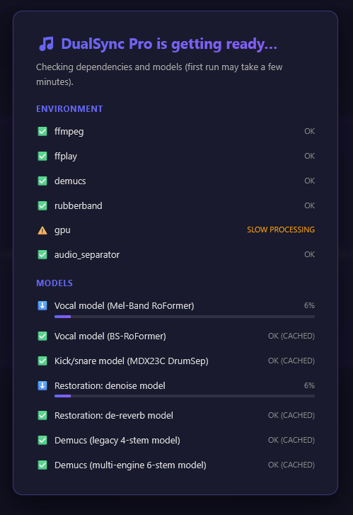
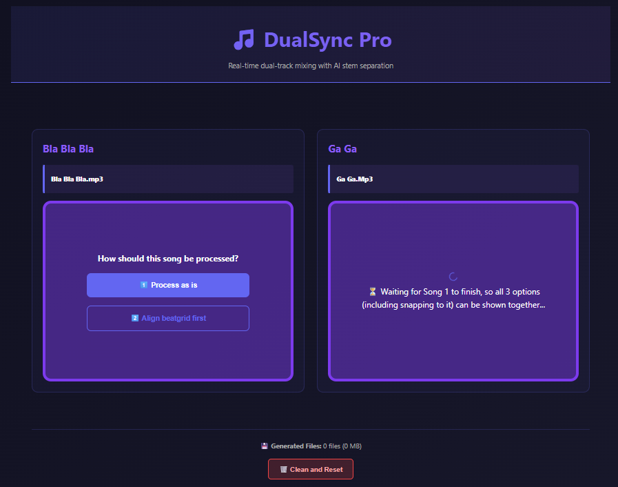
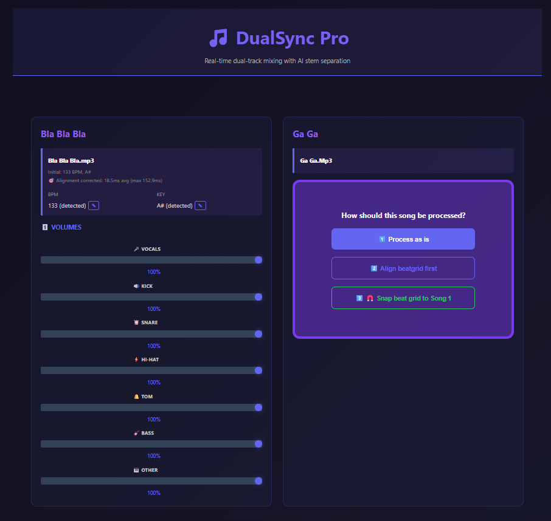
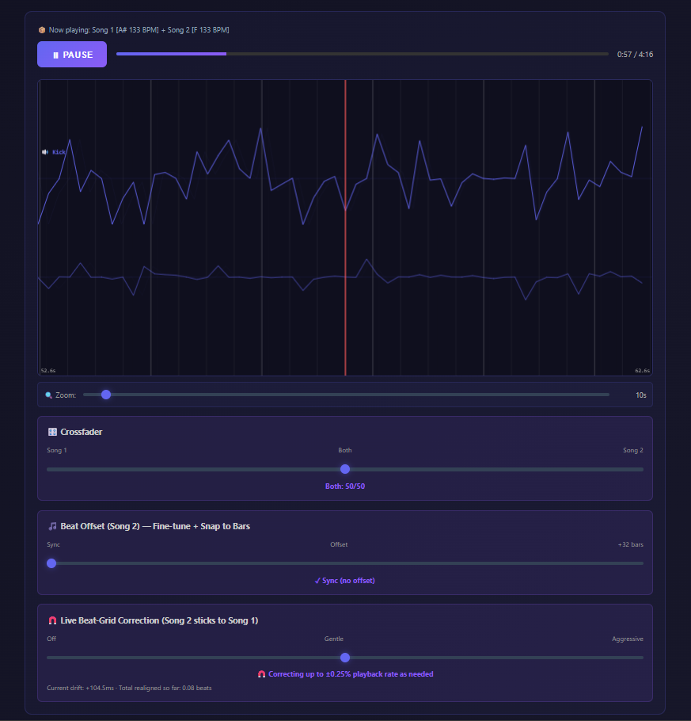
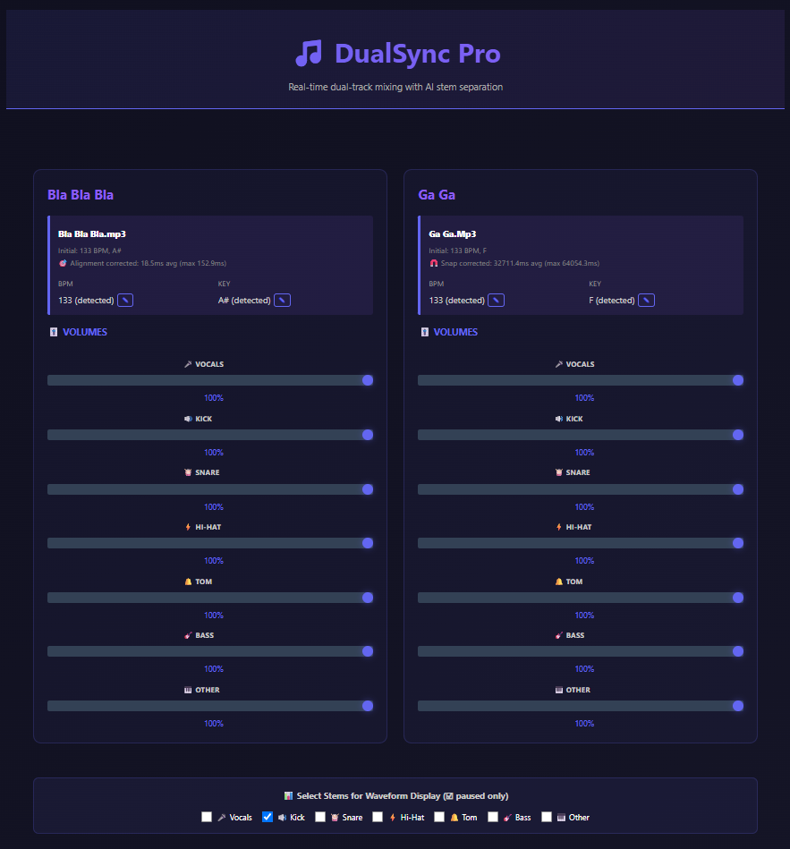
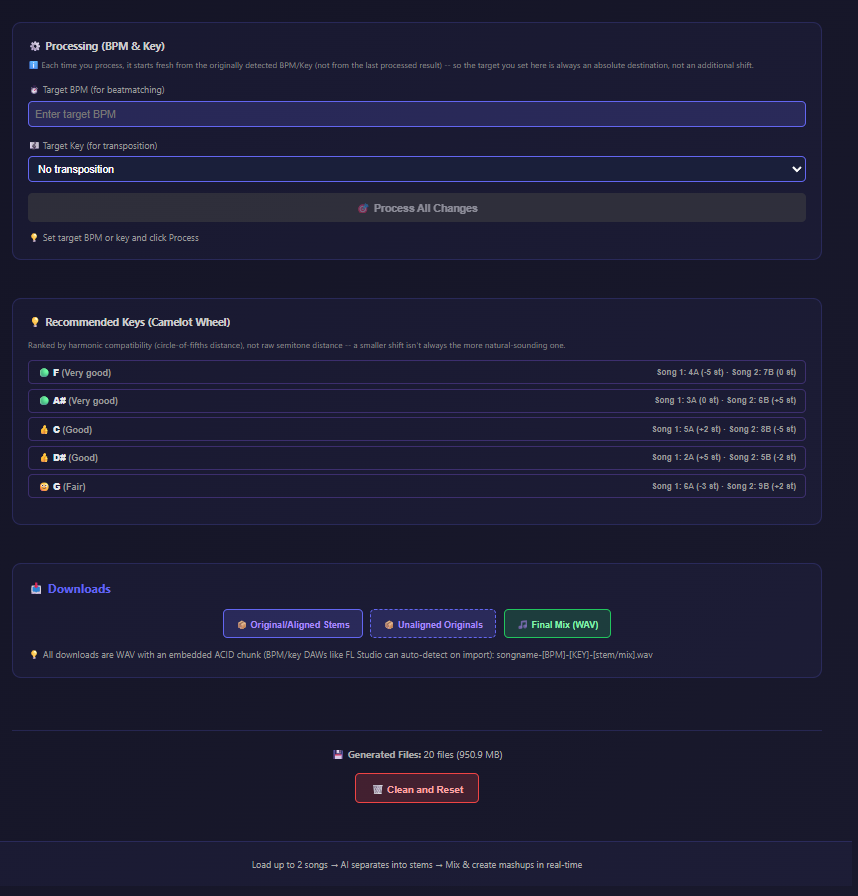

# DualSync Pro

**AI-Powered Dual-Song Real-Time Audio Mixer with Beatmatching & Key Transposition**


DualSync Pro is a modern web application for creating audio mashups. Load two songs side-by-side, automatically detect their BPM and key, beatmatch and transpose them to a common key, and mix the results in real-time with independent stem controls. All audio processing is powered by AI (Demucs for stem separation, Essentia for BPM/key detection) and professional audio tools (FFmpeg/RubberBand for beatmatching and pitch-shifting).


*Figure 1 — Startup overlay.*

---

## ✨ Features

### Real-Time Mixing
- **Dual-song mixer** — load two MP3s into independent slots with synchronized playback
- **HTML5 audio synchronization** — first song's timeline controls both songs for seamless mixing
- **Independent stem volumes** — control 9 stems separately for each song (0-100% sliders):
  - **Vocals** (ensemble of two AI models, averaged — see Audio Analysis & Processing below)
  - **Drums:** Kick, Snare (MDX23C ML), Hi-Hat, Tom (frequency filtering)
  - **Instruments:** Bass, Guitar, Piano (Demucs 6-stem AI, 9.5 dB SDR)
  - **Other** (residual instruments)
  - **Per-stem restoration toggle** (vocals only) — apply denoise + de-reverb on demand from a checkbox next to that slider; testing showed the models hurt non-vocal stems rather than helping
- **Waveform Preview Thumbnails** — visual waveform for each stem in the mixer to quickly verify audio content
- **Crossfader** — blend between Song 1 and Song 2 in real-time
- **Beat Offset Control with Magnetic Snap** — manually align Song 2's beat grid, up to 32 bars:
  - Slider ranges 0-32 bars with 0.05 bar fine-tune precision
  - Snaps to the nearest whole bar automatically when you get close
  - Brief visual feedback shows snap status and current fine-tune value (bars + equivalent beats)
  - Real-time audio delay via Web Audio API during playback — the same offset is baked into the final rendered mix
  - Visual offset indicator on waveform display, with a zoom range large enough to see the full 32-bar offset
- **Live Beat-Grid Drift Correction** — a strength slider (0-100%) continuously nudges Song 2's playback rate to cancel out timing drift during playback, with a live readout of the instantaneous correction (ms) and cumulative beats realigned so far
- **Multi-Stem Waveform Visualization** — advanced beat alignment tool:
  - Select any combination of 9 stems to display (vocals, kick, snare, hi-hat, tom, bass, guitar, piano, other)
  - Color-coded waveforms for each stem (purple, indigo, pink, orange, green, blue, gray)
  - Display both Song 1 and Song 2 simultaneously for each stem
  - Stem selection checkboxes (paused-only to prevent accidental changes)
  - Centered controls between song mixers for easy access
  - Dynamic zoom slider for variable detail levels, wide enough to view large beat offsets
  - Song 2 waveform shifts visually with beat offset for perfect alignment preview
  - Red playhead indicator showing current position
  - Visible during both playback and pause for precise alignment
  - Real-time updates as you adjust beat offset and zoom level
- **Auto-loop playback** — automatically restart at track end during playback
- **Real-time processing logs** — unified log window shows all operations with auto-scroll to latest entry
- **Clean and Reset** — a single button clears all generated audio files on the server AND resets the entire mixer UI back to its start-over state

### Audio Analysis & Processing
- **Multi-Engine Stem Separation (9 stems)** — best-in-class models for maximum quality:
  - **Vocal-model ensemble** (Mel-Band RoFormer 12.6 dB SDR + BS-RoFormer 12.1 dB SDR, averaged sample-by-sample) — cleanest lead vocals; a listening test showed the average beats either model alone (a known technique, UVR's "Ensemble Mode": different architectures make different mistakes, averaging smooths those out)
  - **Demucs htdemucs_6s** (9.5 dB SDR) — bass, guitar, piano, other, drums
  - **MDX23C DrumSep** (SOTA) — ML-based kick and snare isolation
  - **Frequency-based filtering** — hi-hat and tom (fallback, no ML model)
- **Denoise + De-Reverb Restoration (opt-in per stem)** — artifact removal and quality enhancement:
  - Mel-Band Roformer denoise (27.99 dB SDR) then de-reverb (19.17 dB SDR)
  - Not run during separation (it was costing every song several minutes whether or not it helped) — toggle it per stem from a checkbox next to that stem's volume slider instead
  - Vocals only in the UI: these models are trained for vocal cleanup, and testing showed they measurably hurt non-vocal stems (e.g. guitar measured ~11 dB quieter) rather than helping
  - Graceful fallback to spectral filtering if these models can't load
- **BPM & Key Detection** — Essentia (`RhythmExtractor2013` for tempo/beat positions, `KeyExtractor` for key/scale) analyzes each uploaded song in seconds, before any (slow) stem separation happens
- **Two Alignment Modes on Upload** — for each song you choose:
  - **Process as-is** — keep the song's natural timing
  - **Align beatgrid** — correct internal timing drift by warping the song's own beats onto a perfectly even grid (via RubberBand `--timemap`)
  - **Snap beat grid to Song 1** (Song 2 only, once Song 1 is ready) — warp Song 2's actual beat times directly onto Song 1's actual beat times, so both tracks share one true beatgrid without relying on live drift correction
  - Both alignment modes report how much correction was applied (average/max milliseconds moved per beat)
  - This step, and the BPM/Key analysis, are fast (seconds) and happen before you decide whether to separate as-is or target a shared BPM/Key (see "How It Works" below)
- **Beatmatching with Verification** — align Song 2 to Song 1 (or both to target BPM) with automatic multi-pass correction
  - Pass 1: FFmpeg tempo-stretching (stable baseline)
  - Pass 2+: Optional RubberBand for higher quality (if available)
  - Automatic re-analysis after each pass to verify convergence (±10 BPM tolerance)
- **Key Transposition** — pitch-shift tracks to match target key
- **Camelot Wheel Key Recommendations** — ranks up to 5 candidate keys by harmonic distance (circle-of-fifths) to both songs simultaneously, showing a quality label (🟢 Very good / 👍 Good / 🙂 Fair / 🆗 Ok) and the exact Camelot code + semitone shift needed for each song; flags the pair as "✅ No change needed" when they're already harmonically compatible

### Downloads & Exports
- **Lossless WAV with DAW-readable tempo/key metadata** — every exported file is a WAV carrying a Sonic Foundry **ACID chunk** (the convention FL Studio, Logic, Cubase, Reaper, Reason, Sound Forge, and Samplitude all read to auto-detect a sample's tempo and root key on import), plus standard ID3 tags (title, artist, BPM, key)
- **Measured BPM in filenames** — actual output BPM shown in filenames (not target)
- **Smart naming convention:**
  - `songname-[bpm]-[key]-[stem].wav`
  - Manual BPM override: `songname-[target]-manual-[measured]-[key]-[stem].wav`
- **"Download Stems"** — one ZIP with one folder per song, named with its current BPM/Key, containing every stem that song generated:
  - The 9 main stems, at whatever their current state is (as-is, or beatmatched/transposed to a target — a song only ever has one current state, so there's no separate "original" vs "processed" download)
  - **Bonus/reference stems, included for free** since they're already generated as byproducts and not thrown away: the vocal ensemble's two individual models' own vocals + instrumental outputs, and Demucs' own (unused) vocals stem
  - The pre-restoration backup for any stem you've toggled restoration on
- **Beatgrid-Aligned Stems** — optional pre-alignment backup (on-demand), separately
- **Final Mix** — all stems combined with volume settings + crossfader (fully lossless)

### User Experience
- **One adaptive Process button** — reads "Process as is" or "Process with Target BPM/Key" depending on whether a target is set; post-separation it becomes "Process All Changes", enabled only once BPM/Key actually changed from the last processed state
- **Real-time progress indication** — animated progress bars during beatmatching and key transposition
- **Processing state display** — "Now playing" line shows each song's current BPM/Key while mixing
- **Drag-and-drop upload** — intuitive file loading with visual feedback
- **Responsive design** — works on desktop browsers
- **Locked controls during processing** — all mixing controls disabled while beatmatching or transposition is in progress

### Startup & Reliability
- **Blocking startup overlay** — on launch, the app checks every dependency (FFmpeg, RubberBand, GPU, `audio-separator`) and pre-fetches any AI models that aren't cached yet, showing live per-item status (queued → checking → downloading → done) before you can start using it — no more surprise multi-GB download stalling your first real separation
- **Parallel model downloads** — all 7 models (5 vocal/drum/restoration models + 2 Demucs presets) download simultaneously instead of one after another
- **Live download progress bars** — real byte-level percentage per model, not just a spinner
- **Non-blocking optional warnings** — a missing optional dependency (no GPU, no RubberBand) shows a short, clear label ("slow processing", "align/snap disabled") instead of holding up the app or reading like a real error
- **Corrupted-download protection** — a model file that got truncated by an interrupted previous run (wrong size on disk) is automatically detected and re-fetched, instead of silently failing much later during real separation

---

## How It Works

### 1. Upload & Analyze
When you upload an MP3 file:
1. **Upload & Convert** — the file is converted to WAV
2. **Choose a mode** — Process as-is, Align beatgrid, or (for Song 2, once Song 1 is ready) Snap beat grid to Song 1
3. **Fast analysis** (seconds, not minutes) — the chosen alignment step runs, then Essentia detects BPM, beat grid, and key. No stem separation yet: this is deliberately a separate, fast step so you see real detected values (and can override them) before committing to the slow part below

Both songs are analyzed independently and in parallel (independent uploads).


*Figure 2 — Song 1 during initial upload/processing, with its alignment-mode choice.*


*Figure 3 — Song 2 during initial upload/processing, including the "Snap beat grid to Song 1" option once Song 1 is ready.*

### 2. Choose How to Process
Once **both** songs are analyzed, you can:
- **Override detected BPM** — manually enter a value if auto-detection is wrong
- **Override detected Key** — manually select a different key from dropdown
- **Pick a recommended key** — the Camelot Wheel panel ranks up to 5 harmonically compatible keys for both songs together, or tells you no change is needed

Then click one button, which reads either:
- **"Process as is"** (no target BPM/Key set) — each song keeps its own detected BPM/Key
- **"Process with Target BPM/Key"** (once you've set one or both) — both songs are beatmatched/transposed to the same shared target before separating

### 3. Stem Separation
Clicking that button kicks off the (slow) part for **both songs in parallel**:
1. If a target was set: beatmatch/transpose the full song first (cheaper and phase-cleaner than processing 9 separated stems individually)
2. **Multi-Engine Stem Separation** (parallel GPU pipeline, ~10-15 min total):
   - **Stage 1 (parallel):** vocal-model ensemble extracts vocals + Demucs htdemucs_6s separates 6 stems
   - **Stage 2:** MDX23C DrumSep isolates kick/snare from the drums stem + frequency filtering for hi-hat/tom
   - **Stage 3:** stems assembled (no restoration here — that's opt-in per stem afterward, see Audio Analysis & Processing above)
3. **Result:** 9 professional stems (7 ML-separated + 2 frequency-filtered), plus a handful of bonus/reference stems kept as free byproducts (see Downloads & Exports)
4. **Real-Time Logging** — unified log window shows every stage as it happens for both songs
5. The volume/mixer view only appears once **both** songs have finished separating

Set a new target and click the button again any time afterward (now labeled "Process All Changes") to reprocess the already-separated stems to a different BPM/Key — it always starts fresh from the originally-detected values, not from wherever the last reprocess left off.

### 4. Mix in Real-Time
After processing:
- **Advanced Beat Alignment:**
  - **Magnetic Snap Beat Offset** — drag slider (0-32 bars, 0.05 bar fine-tune increments):
    - Slider automatically snaps to the nearest whole bar
    - Brief visual feedback shows "Snapped" + fine-tune value (bars and equivalent beats) while near a bar boundary
    - Real-time audio delay applied during playback (Web Audio API) — identical offset is used in the final render
  - **Live Beat-Grid Drift Correction** — a strength slider continuously nudges Song 2's playback rate toward Song 1's grid, with a live instantaneous-drift (ms) and cumulative-realignment (beats) readout
  - Watch Song 2 waveform shift visually as you adjust offset (shows actual alignment)
  - Select any of 9 stems to display in waveform (vocals, kick, snare, hi-hat, tom, bass, guitar, piano, other)
  - Zoom waveform dynamically for the detail level you need, wide enough to see the full 32-bar offset range
  - Compare both Song 1 and Song 2 waveforms side-by-side
  - Color-coded stems for easy identification (purple/indigo/pink/orange/green/blue/cyan/etc.)
  - Pause to inspect waveforms without playhead movement


*Figure 5 — The multi-stem waveform display during live playback, showing both songs' beat alignment.*

- **Volume Mixing:**
  - Adjust 9 stem volumes independently for Song 1 and Song 2
  - Waveform preview thumbnail for each stem to verify audio content
  - Use crossfader to blend between songs (0% Song 1 → 50% Both → 100% Song 2)


*Figure 4 — The real-time mixing workspace, with per-stem volume sliders and crossfader for both songs.*

- **Playback Control:**
  - Play/Pause and scrub through timeline (resumes from paused position)
  - Auto-loop at track end
- **Listen:** Hear the beatmatched, transposed, beat-aligned mix in real-time with visual confirmation

### 5. Download
Download your results:
- **"Download Stems"** — one ZIP, one folder per song (named with its current BPM/Key), containing every stem that song has right now: the 9 main stems (Vocals, Kick, Snare, Hi-Hat, Tom, Bass, Guitar, Piano, Other) plus the bonus/reference byproducts (see Downloads & Exports above) plus any restoration backups
- **Beatgrid-Aligned Stems** (optional) — pre-alignment backup if you used beatgrid correction, downloaded separately
- **Final Mix** — all stems combined with your volume settings and crossfader position

All files are lossless WAV with an embedded ACID chunk (BPM + key, DAW-readable) plus ID3 tags (TITLE, BPM, KEY).


*Figure 6 — The processing progress bar and download buttons for stems and the final mix.*

- **Clean and Reset** — one button deletes the generated audio files (and the separation cache) on the server, and resets the whole UI so you can start over with new songs

---

## Architecture

### Frontend (React)
- **React 18** — interactive UI for real-time mixing
- **Vite** — fast development server and bundler
- **HTML5 Audio API** — synchronized playback of dual songs
- **DualMixer.jsx** — main component managing:
  - Upload and file handling
  - BPM/Key processing state and UI
  - Stem volume sliders for 9 stems (per-song)
  - Waveform preview thumbnails (visual feedback for each stem)
  - Crossfader control
  - Playback synchronization
  - Progress indication during processing
- **WaveformPreview.jsx** — 120x40px waveform visualization
  - HTML5 AudioContext for audio decoding
  - Canvas rendering with color-coded stems
- **StartupOverlay.jsx** — blocking startup screen shown while dependencies are checked and models are fetched
  - Polls `/api/startup-status`; shows every check/model live (queued → checking → downloading with a real progress bar → done)
  - OK button appears once every required item resolves; optional issues (no GPU, etc.) never hold it up

### Backend (Flask)
- **Flask** + Flask-CORS — REST API for audio processing
- **Real-Time Processing Logs** — unified log system with streaming updates
- **API Endpoints:**
  - `POST /api/upload-audio` — upload a song and convert it to WAV
  - `POST /api/analyze-song` — fast (seconds): run the chosen mode's align/snap step, then analyze BPM/key — no separation yet
  - `POST /api/process-song` — separate stems from an already-analyzed WAV at its own detected BPM/Key ("process as is")
  - `POST /api/process-stems` — beatmatch/transpose the full song to a shared target BPM/Key, then separate — used both for the very first separation (if a target was set) and to reprocess later
  - `POST /api/restore-stem` — apply or revert denoise + de-reverb restoration for one stem on demand (vocals only in the UI)
  - `GET /api/process-status` — returns current processing progress (0-100%), current stage, and real-time log messages
  - `POST /api/render-final-mix` — mix all 9 stems into the final lossless WAV, with an ACID chunk + ID3 tags
  - `POST /api/download-stems-zip` — download every generated stem for both songs as tagged WAV in a ZIP, one folder per song
  - `POST /api/download-unaligned-stems` — download the pre-alignment 9 stems as tagged WAV in a ZIP
  - `GET /api/download-file/<filename>` — download single audio file
  - `GET /api/audio/<path>` — serve individual audio files
  - `GET /api/audio-stats` — audio level/statistics for a file
  - `POST /api/split-drums` — split a drums stem into kick/snare/hihat/tom
  - `POST /api/cleanup` — delete all generated audio files and the stem-separation cache (used by "Clean and Reset")
  - `GET /api/health` — health check; also returns the dependency/environment checks (FFmpeg, RubberBand, GPU, etc.)
  - `GET /api/startup-status` — polled by the blocking startup overlay for live dependency-check and model-download progress

### Audio Processing Core (Python)
- **Multi-Engine Stem Separation Pipeline (9 stems):**
  - **Vocal-model ensemble** (Mel-Band RoFormer 12.6 dB SDR + BS-RoFormer 12.1 dB SDR, averaged) — lead vocals
  - **Demucs htdemucs_6s** (9.5 dB SDR) — bass, guitar, piano, other, drums
  - **MDX23C DrumSep** (SOTA) — kick, snare from drums stem
  - **Frequency filtering** — hi-hat, tom (fallback)
  - **Denoise + De-Reverb** (Mel-Band Roformer, 27.99 / 19.17 dB SDR) — opt-in per stem (vocals only), applied on demand rather than during separation
- **Essentia** — BPM/beat-grid detection (`RhythmExtractor2013`) and key detection (`KeyExtractor`)
- **FFmpeg** — tempo-stretching, pitch-shifting, spectral filtering, final mix rendering
- **RubberBand** — per-beat beatgrid warping (align/snap modes) and optional higher-quality time-stretching (Pass 2+)
- **Mutagen** — WAV/ID3 metadata tagging (title, BPM, key); a hand-built RIFF ACID chunk provides DAW-readable tempo/key
- **Beatgrid intro-skipping** — kick-transient detection (crest-factor validated) trims a vague/drum-less intro off before Essentia analysis, so `beat_anchor` isn't anchored to weak content at the start of the track; see CLAUDE.md's "Beatgrid & Kick-Transient Detection" for the full mechanism
- **Model prefetch & locking** — all 7 AI models download in parallel at startup (not per-song), guarded by per-model-file locks against Song 1/Song 2's parallel processing threads racing on the same download; see CLAUDE.md's "Startup: Dependency Checks & Model Prefetch"

### File Structure
```
DualSync-Pro/
├── frontend/                     # React app
│   ├── src/
│   │   ├── components/
│   │   │   ├── DualMixer.jsx    # Main mixing interface
│   │   │   ├── StartupOverlay.jsx  # Blocking startup checks/model-download screen
│   │   │   └── ...
│   │   ├── styles/
│   │   └── App.jsx
│   ├── vite.config.js
│   └── package.json
├── server.py                     # Flask REST API endpoints
├── mashup_engine.py              # Audio processing core
├── validate_pipeline.py          # Dev/QA: sanity-check beatgrid detection against real audio
├── requirements.txt              # Python dependencies
├── separated_stems/[hash]/       # Stem-separation cache (git-ignored)
├── Audio/                        # Generated stems/mixes (git-ignored)
│   ├── stems/[timestamp]/        # Stems per processed song
│   ├── renders/                  # Final mixes
│   ├── validation_tracks/        # Test tracks for validate_pipeline.py (git-ignored)
│   └── ...                       # Uploaded/aligned WAVs, download ZIPs
└── ...
```

---

## Clone, Install & Update

### Prerequisites
- **Python 3.10+** (3.12+ recommended)
- **Node.js 16+** (for React frontend)
- **FFmpeg** (for audio processing)
- **Internet connection** (first run downloads ~3.5GB across 7 models — Demucs ~134MB, the audio-separator vocal/drum/restoration models ~3.4GB — all fetched in parallel by the startup overlay, cached persistently afterward)

### Clone the Repository

```bash
git clone https://github.com/laudaniels/DualSync-Pro.git
cd DualSync-Pro
```

### Install Python Backend

**Create and activate virtual environment:**

```bash
# macOS/Linux
python3 -m venv .venv
source .venv/bin/activate

# Windows (PowerShell)
python -m venv .venv
.venv\Scripts\Activate.ps1

# Windows (Command Prompt)
python -m venv .venv
.venv\Scripts\activate.bat
```

**Install Python dependencies:**

```bash
pip install -r requirements.txt
```

This installs:
- Flask & Flask-CORS (web server)
- Librosa (BPM detection)
- Essentia (key detection fallback)
- Demucs (bass/guitar/piano/other/drums separation)
- audio-separator + onnxruntime (vocal-model ensemble, DrumSep, denoise + de-reverb restoration)
- Mutagen (FLAC metadata)
- (Optional) RubberBand for higher-quality time-stretching

### Install Frontend Dependencies

```bash
cd frontend
npm install
cd ..
```

### Install System Dependencies

**FFmpeg:**
- **macOS:** `brew install ffmpeg`
- **Ubuntu/Debian:** `sudo apt-get install ffmpeg`
- **Fedora:** `sudo dnf install ffmpeg`
- **Windows:** Download from [ffmpeg.org](https://ffmpeg.org/download.html) or `choco install ffmpeg`

**Verify FFmpeg installation:**
```bash
ffmpeg -version
```

**Optional: RubberBand (for higher-quality beatmatching)**
- **macOS:** `brew install rubberband`
- **Ubuntu/Debian:** `sudo apt-get install librubberband-dev`
- **Fedora:** `sudo dnf install rubberband-devel`
- **Windows:** Download from [breakfastquay.com](https://breakfastquay.com/rubberband/)

### Running the Application

**Start the Flask backend (Terminal 1):**

```bash
source .venv/bin/activate    # or .venv\Scripts\activate on Windows
python3 server.py
```

Output (first run — dependency checks, then downloading whatever's not cached yet, ~3.5GB total, all in parallel):
```
============================================================
DualSync Pro -- startup checks
============================================================
✅ ffmpeg: Required for all audio conversion/mixing -- app will not function without it.
✅ ffplay: Used for in-app preview playback only.
✅ demucs: Required for stem separation (both legacy and multi-engine mode).
✅ rubberband: Required for the 'Align beatgrid' and 'Snap to reference' features only -- the rest of the app works without it.
⚠️  gpu: No GPU detected -- separation will still work but run much slower on CPU.
✅ audio_separator: Multi-engine (9-stem) mode is available.
------------------------------------------------------------
Checking cached models (downloads anything missing)...
  ⬇️  Vocal model (Mel-Band RoFormer): downloading (40%)
  ⬇️  Vocal model (BS-RoFormer): downloading (60%)
  ...
✅ Model prefetch complete.
============================================================
Serving on http://127.0.0.1:5000
```
On every later run, once everything's cached, this whole sequence takes a couple of seconds. Meanwhile the browser shows a blocking startup overlay with the same information (see the Features section) — you don't need to watch this terminal output, it's just there too.

**Start the React frontend (Terminal 2):**

```bash
cd frontend
npm run dev
```

Output:
```
Local:   http://localhost:5173
```

Open `http://localhost:3000` in your browser.

### Update to Latest Version

**Pull latest code:**

```bash
git pull origin main
```

**Update Python dependencies:**

```bash
source .venv/bin/activate    # or .venv\Scripts\activate on Windows
pip install -r requirements.txt --upgrade
```

**Update Node dependencies:**

```bash
cd frontend
npm install
cd ..
```

**Restart both servers** (Stop with Ctrl+C and run again):
- Flask: `python3 server.py`
- React: `npm run dev` (from `frontend/` directory)

---

## Troubleshooting

### Model Download Fails or Gets Stuck
On first run, the startup overlay downloads ~3.5GB across 7 AI models (all in parallel) before the app becomes usable — this needs an internet connection and can take several minutes depending on your connection. Watch the server's own terminal output for per-model progress; a model that fails shows a clear `error` status in the overlay (with the underlying error printed server-side) instead of hanging silently.

**If a specific model seems stuck or corrupted, force a re-fetch by deleting its cached file and restarting the server:**
```bash
# audio-separator models (vocals/drums/restoration)
rm ~/.cache/audio-separator-models/<filename>.ckpt

# Demucs models
rm -rf ~/.cache/huggingface/hub/models--adefossez--HTDemucs      # legacy 4-stem
rm -rf ~/.cache/huggingface/hub/models--adefossez--HTDemucs-6s   # multi-engine 6-stem
```
The startup check re-downloads whatever's missing the next time `python3 server.py` runs; it also auto-detects and re-fetches an audio-separator model whose file size doesn't match the expected size (a truncated download from an interrupted previous run), so this manual step should rarely be needed.

### FFmpeg Not Found
Ensure FFmpeg is in your system PATH:
```bash
ffmpeg -version
```

If not found, install it (see System Dependencies above).

### Port Already in Use
- **Flask (5000):** Edit `server.py`, change `port=5000` to another port
- **React (5173):** Vite uses first available port, or edit `frontend/vite.config.js`

### "Can't enter BPM" or Input Frozen
This is fixed in the current version. Make sure you're on the latest branch:
```bash
git pull origin main
```

### RubberBand Build Fails
RubberBand is optional. If install fails, the app still works with FFmpeg (Pass 1). To skip RubberBand:
```bash
pip install -r requirements.txt --no-build-isolation
```

---

## Basic Workflow

1. **Upload Song 1** — drag-and-drop MP3 or click upload area
2. **Upload Song 2** — same as Song 1 (independent, doesn't wait for Song 1)
3. **Choose alignment mode per song** — process as-is, align beatgrid, or (Song 2, once Song 1 is analyzed) snap to Song 1
   - This triggers the fast analysis step (seconds): BPM (5-pass detection) and key auto-detected, no separation yet
4. **Review metadata** — check detected BPM/key for each song, and how much grid correction was applied
5. **Optional overrides:**
   - Change target BPM (if auto-detection is wrong)
   - Change target key (from dropdown)
   - Pick one of the Camelot Wheel recommended keys
6. **Once both songs are analyzed, click the button** (reads "Process as is" or "Process with Target BPM/Key", whichever applies) — kicks off stem separation for both songs **in parallel**
   - Real-time log shows every stage as it happens for both songs
   - The volume/mixer view appears once both songs have finished
7. **Mix in real-time:**
   - Adjust 9 stem volumes independently for each song
   - Toggle denoise + de-reverb restoration per vocals stem if you want it
   - Use crossfader to blend between songs
   - Fine-tune beat offset (up to 32 bars) and/or enable live drift correction
   - Play/Pause and scrub timeline
8. **Reprocess anytime** — set a new target BPM/Key and click the button again (now labeled "Process All Changes") to beatmatch/transpose the already-separated stems
9. **Download:**
   - Download Stems (ZIP, one folder per song with every stem it has, including bonus/reference stems)
   - Final Mix (single tagged WAV file with all stems mixed at your volume settings)
10. **Clean and Reset** — clear generated files (and the separation cache) and start over

---

## Key Concepts

### BPM Detection & Beatmatching
- **Detection:** Essentia's `RhythmExtractor2013` analyzes each song's beat positions and BPM, in seconds, before any separation
- **Beatmatching:** FFmpeg tempo-stretching aligns both songs to a shared target BPM
- **Verification:** Output BPM is measured after each pass; if off by >±10 BPM, another pass is applied
- **Filenames:** Show actual measured output BPM, not target BPM (e.g., if target=112, output might be 111.8)

### Beatgrid Alignment Modes
- **Align beatgrid:** warps a song's own beats onto a perfectly even internal grid (corrects vinyl/tempo drift), via RubberBand `--timemap`
- **Snap beat grid to Song 1:** warps Song 2's actual beat times directly onto Song 1's actual beat times, so the two tracks share one true grid — this is an alternative to relying on live drift correction during playback
- Both modes report the average and maximum per-beat correction applied, in milliseconds

### Key Recommendation Algorithm (Camelot Wheel)
- Computes each song's Camelot code from its detected key/scale
- Ranks all 12 candidate keys by circle-of-fifths distance to both songs' keys simultaneously (mode-independent), scoring 0-4 (lower is more compatible) and preferring same-mode matches
- Returns up to 5 ranked suggestions, each showing a quality label/emoji, and the exact Camelot code + semitone shift needed per song
- Detects when the two songs are already harmonically compatible (same/relative/adjacent Camelot code) and shows a "✅ No change needed" banner instead

### The Process Button
- One button, labeled "Process as is" or "Process with Target BPM/Key" depending on whether a target is set — enabled once both songs are analyzed, or (post-separation) once BPM/Key changed from the last processed value
- **All controls** — locked during processing (can't change volumes, crossfader, etc.)

---

## File Naming Examples

### Main Stems (9-Stem Multi-Engine Mode)
```
Part3-Venus-96-C-vocals.wav          # 96 BPM, Key C -- vocal-model ensemble
Part3-Venus-96-C-kick.wav            # MDX23C DrumSep (ML)
Part3-Venus-96-C-snare.wav
Part3-Venus-96-C-hihat.wav           # Frequency-filtered (no ML model)
Part3-Venus-96-C-tom.wav
Part3-Venus-96-C-bass.wav
Part3-Venus-96-C-guitar.wav
Part3-Venus-96-C-piano.wav
Part3-Venus-96-C-other.wav
```
Whatever BPM/Key is shown is the song's **current** state -- its own detected
values if processed "as is", or the shared target if beatmatched/transposed.

### Bonus/Reference Stems (included in "Download Stems" for free)
```
Part3-Venus-96-C-extra_vocals_melband_roformer.wav     # one ensemble model alone
Part3-Venus-96-C-extra_instrumental_melband_roformer.wav
Part3-Venus-96-C-extra_vocals_bs_roformer.wav           # the other ensemble model alone
Part3-Venus-96-C-extra_instrumental_bs_roformer.wav
Part3-Venus-96-C-extra_vocals_demucs.wav                # Demucs' own (unused) vocals
```

### With Manual BPM Override
```
Part3-Venus-112-manual-111.8-measured-F-vocals.wav
# Target: 112 BPM, Measured output: 111.8 BPM, Key: F
```

---

## Output Directory Structure

All generated files are stored in `Audio/` folder with timestamps (git-ignored),
plus a separate stem-separation cache:

```
Audio/
├── stems/
│   └── [timestamp]/                          # Every stem for one processed song
│       ├── vocals.wav                        # 9 main stems ...
│       ├── kick.wav                          # ... (snare, hihat, tom, bass, guitar, piano, other)
│       ├── vocals_original.wav               # pre-restoration backup (restore-stem toggle)
│       ├── vocals_restored.wav               # cached restored version, if ever toggled on
│       ├── extra_vocals_melband_roformer.wav # bonus/reference stems ...
│       ├── extra_instrumental_melband_roformer.wav
│       ├── extra_vocals_bs_roformer.wav
│       ├── extra_instrumental_bs_roformer.wav
│       └── extra_vocals_demucs.wav
├── renders/
│   └── [timestamp]_final_mix.wav             # Final stereo mix with ACID chunk + ID3 tags
└── ...                                       # Uploaded/aligned WAVs, download ZIPs

separated_stems/
└── [hash]/                             # Per-song separation cache (cleared by "Clean and Reset")
```

Downloaded files are lossless WAV with embedded metadata:
- **ACID chunk:** BPM and root key, read automatically by FL Studio, Logic, Cubase, Reaper, Reason, Sound Forge, and Samplitude
- **TIT2/TPE1:** Song name(s)
- **TBPM:** Measured output BPM (after beatmatching)
- **TKEY:** Target key (after transposition)

---

## Requirements

See `requirements.txt` for complete Python dependencies. Key packages:
- **Flask** — REST API server
- **librosa** — BPM detection and audio analysis
- **essentia** — BPM, beat-grid, and key detection
- **demucs** — bass/guitar/piano/other/drums separation
- **audio-separator** + **onnxruntime** — vocal-model ensemble, DrumSep, denoise + de-reverb restoration
- **mutagen** — WAV/ID3 metadata tagging
- **pydub** — audio manipulation (optional)

React frontend requires Node.js 16+ with packages listed in `frontend/package.json`.

---

## System Requirements

- **Processor:** Modern CPU (Intel i5+ or AMD Ryzen 5+) recommended for real-time mixing
- **RAM:** 8GB minimum, 16GB recommended (stem separation uses ~2-4GB per song)
- **Storage:** 50GB+ free space (Demucs + audio-separator models ~3.5GB total, plus generated stems/mixes)
- **Network:** Internet required for the initial model download (~3.5GB total, fetched in parallel at startup)

---

## Performance Notes

- **First run:** all 7 models — Demucs `htdemucs`/`htdemucs_6s` (~134MB, `~/.cache/huggingface`) and the 5 audio-separator models (vocal ensemble, DrumSep, denoise, de-reverb — ~3.4GB, `~/.cache/audio-separator-models`) — download once, **in parallel**, behind the startup overlay, and are cached persistently, so this cost is paid only once, ever, not per song
- **Analysis:** seconds — BPM/Key detection runs before any separation, so you see real detected values right away
- **Stem separation:** ~10-15 min per song, running for both songs in parallel (restoration is no longer part of this — it's opt-in per stem afterward)
- **Beatmatching:** 30 seconds to 2 minutes (depends on convergence)
- **Real-time mixing:** Smooth 60+ FPS on modern browsers
- **File downloads:** near-instant, since the final mix is written as lossless WAV directly (no lossy intermediate encode/decode step)

---

## Disclaimer

This tool is for educational and creative purposes. Only use audio files you own or have permission to use. The developer is not responsible for copyright violations or misuse.

**Stem separation is AI-powered and experimental.** Demucs does its best to isolate instruments, but results are not perfect. Use downloaded stems as a starting point, not as final-quality isolated tracks.

---

## Credits

- **AI Stem Separation:** [Demucs](https://github.com/facebookresearch/demucs) by Meta
- **Audio Analysis:** [Librosa](https://librosa.org/) and [Essentia](https://essentia.upf.edu/)
- **Audio Stretching:** [RubberBand](https://breakfastquay.com/rubberband/) by Breakfast Quay
- **Project Inspiration:** [Neon Mashup Studio](https://github.com/codewithpb11/neon-mashup-studio) by Pramit Bakski

---

## License

MIT License. See [LICENSE](LICENSE) for details.

---

**Last Updated:** 2026-09-30  
**Current Branch:** main

## Recent Improvements (2026-09-30)
- ✅ **Beatgrid intro-skipping:** kick-transient detection (crest-factor validated against 38 real tracks) now trims a vague/drum-less intro before BPM/beat analysis, instead of anchoring the whole beatgrid to whatever weak content sits at the start of the track
- ✅ Fixed a real bug in the beatgrid-snap/align warp: it used to assume the first detected beat was always at grid position zero, which broke once intro-skipping could push that first beat tens of seconds into the track — producing a nonsensical multi-second "correction" instead of a real one
- ✅ New `validate_pipeline.py` dev tool to sanity-check the above against a folder of real audio files (candidates found, chosen trim point, timing, crashes)
- ✅ **Startup overlay:** the app now checks every dependency (FFmpeg, RubberBand, GPU, `audio-separator`) and pre-fetches any missing AI models before you can start using it, with live per-item progress — no more a multi-GB download silently starting mid-way through your first real separation
- ✅ All 7 AI models now download **in parallel** at startup instead of one after another, with real byte-level progress bars for the 5 largest ones
- ✅ Fixed a genuine race condition where Song 1 and Song 2's parallel processing threads could both start downloading the same model file at the same time; also added automatic detection of a truncated/corrupted cached model (from an interrupted previous download) instead of silently using it

## Earlier Improvements (2026-09-27)
- ✅ Vocal quality: fixed a long-standing mismatch where the code loaded a lower-quality Karaoke model instead of the documented one, then upgraded further to an ensemble (two models, averaged) after a listening test showed it beats either model alone
- ✅ Analyze-first flow: BPM/Key detection now runs as its own fast (seconds) step before the slow stem separation, so you see real detected values (and can override them) before choosing "process as is" vs a shared target BPM/Key
- ✅ Both songs now separate **in parallel** once you make that choice, instead of one after another
- ✅ Denoise + de-reverb restoration is now opt-in per stem (vocals only) via a checkbox next to the slider, instead of always running on all 9 stems during separation — cuts several minutes off every separation, and testing showed the models were hurting non-vocal stems anyway
- ✅ "Download Stems" now includes every generated stem in one folder per song (named with its current BPM/Key), including bonus/reference stems that were already being generated and thrown away — no more separate, identical "original" vs "processed" downloads
- ✅ "Clean and Reset" now also clears the stem-separation cache, not just uploaded/generated audio (downloaded model weights are left alone)

## Earlier Improvements (2026-09-13)
- ✅ Per-song alignment modes on upload: process as-is, align beatgrid, or snap Song 2's beat grid to Song 1
- ✅ Camelot Wheel key recommendations (up to 5 ranked suggestions, harmonic-compatibility detection)
- ✅ Beat offset extended to 32 bars with a properly-scaled magnetic-snap slider and matching waveform zoom
- ✅ Live beat-grid drift correction with adjustable strength and an instantaneous/cumulative correction readout
- ✅ Final mix render now honors the exact beat offset and stem volumes heard during live playback
- ✅ Exports switched from FLAC to lossless, ACID-chunk-tagged WAV so FL Studio/Logic/Cubase/Reaper/etc. auto-detect tempo and key
- ✅ "Clean and Reset" button clears generated files and resets the entire mixer UI in one click

## Earlier Improvements (2026-09-10)
- ✅ Automatic drum component splitting (kick, snare, hi-hat, tom) with frequency-based FFmpeg filtering
- ✅ Real-time processing logs with unified window display and auto-scroll to latest entry
- ✅ 5-pass BPM detection strategy with middle sampling for small files (avoids intro sections)
- ✅ Combined BPM & Key processing into single "Process All Changes" button
- ✅ Backend fallback for drum splitting failure (duplicates drum stem if separation fails)
- ✅ Full song processing approach (process full song first, then re-separate into stems)
- ✅ Real-time log display during upload, analysis, beatmatching, transposition, and stem copying
